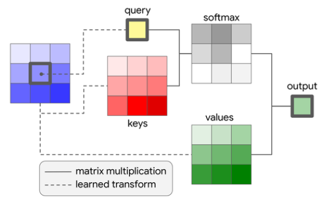

<br />
<p align="center">
  <a href="#">
    
  </a>

  <h3 align="center">Pattern Recognition & Computer Vision</h3>
  <p align="center">
    Fine-tuning code and pre-trained models
    <br />
    <a href="https://arxiv.org/pdf/2010.11929.pdf"><strong>Explore the official paper »</strong></a>
  </p>
</p>


<!-- TABLE OF CONTENTS -->
<details open="open">
  <summary>Table of Contents</summary>
  <ol>
    <li>
      <a href="#about-the-project">About The Code</a>
      <ul>
        <li><a href="#built-with">Built with</a></li>
      </ul>
    </li>
    <li>
      <a href="#getting-started">Working & Test</a>
      <ul>
        <li><a href="#prerequisites">Prerequisites</a></li>
      </ul>
    </li>
    <li><a href="#usage">Usage</a></li>
    <li><a href="#contributing">Contributing</a></li>
    <li><a href="#acknowledgements">Acknowledgements & Resources</a></li>
  </ol>
</details>


<!-- ABOUT THE PROJECT -->
## About The Project

Statistical pattern recognition, nowadays often known under the term "machine learning", <br />is the key element of modern computer science. Its goal is to find, learn, and recognize patterns in complex data, <br />for example in images, speech, biological pathways, the internet.

* This repo is a gist of implementation of the Vision Transformation which was introduced in the <a href="https://arxiv.org/pdf/2010.11929.pdf">paper</a>: An Image is worth 16x16 words
* This repository is uses Py-Torch implementation availabale <a href="https://github.com/rwightman/pytorch-image-models">here</a>
* The Py-Torch repository has pre-trained weights

</br>
<div style="text-align:center"></div>
</br>
The code just a rewrite & straight implementation of the VisionTransformer class, with minor modifications <br /> and simplifications the class function is easier to run & modify for future work to patch and embed images for classification.

A list of commonly used resources that I find helpful are listed in the acknowledgements.

### Built With

The raw implementation of code is built using `python3.7.9` & `pip20.0`
* [Python](https://www.python.org/downloads/release/python-379/)
* [Pip](https://pypi.org/project/pip/)


<!-- GETTING STARTED -->
## Getting Started
<div style="text-align:center"></div>


<h3>A quick overview of the architecture</h3>

<p>The Vision Transformer is an image classifier which takes in an image and outputs the class & sub-class prediction, <b>HOWEVER</b>, <br/>it does that <i>without any convolutional layer</i>, <b>INSTEAD</b> it uses the <i>attention layers</i> which is used already in NLTK, that is-an Attention Mechanism is also an attempt to implement the same action of selectively concentrating on a few relevant things, <br/> while ignoring others in deep neural networks, However, in computer vision, convolutional neural networks (CNNs) are still the norm and self-attention just began to slowly creep into the main body of research.</p>

The network is trained in three steps where image is turned in sequence of 1D tokens to use transform architecture:
* Fine-tuning of the global features pretrained by ImageNet & flatten the patches into 1D vectors.
* Mask inference to obtain the cropped images and perform fine-tuning of the local feature. Hereby, the weights in the global features are fixed.
* Concatenating of the global and local feature outputs and fine-tuning of the fusion feature while freezing the weights of the other features.
* The position embeding allows the network to determine what part of the image a specific patch came from.


<div style="text-align:center">

<i><small>stand-alone self-attention</small></i></div>


### Prerequisites

Install the dependencies before running the `compute.py` file
* pip
  ```sh
  $ pip install -r requirements.txt
  ```


<!-- USAGE EXAMPLES -->
## Usage
<p>First, build & download the model using command:</p>

```sh
python run_model.py
```
you can change the attributes & parameters by, the default image is `384x384`:
```sh
custom_config = {
    "img_size": 384,
    "in_chans": 3,
    "patch_size": 16,
    "embed_dim": 768,
    "depth": 12,
    "n_heads": 12,
    "qkv_bias": True,
    "mlp_ratio": 4,
}

```

</br>

To run the classification function and predict probability output:

```sh
python compute.py -image or -i <image destination, usually the base dir>
```


<!-- CONTRIBUTING -->
## Contributing

Contributions are what make the open source community such an amazing place to be learn, inspire, and create. Any contributions you make are **greatly appreciated**.

1. Fork the Project
2. Create your Feature Branch (`git checkout -b feature/FeaturePatch-VisionTransformation`)
3. Commit your Changes (`git commit -m 'Add some updates'`)
4. Push to the Branch (`git push origin feature/FeaturePatch-VisionTransformation`)
5. Open a Pull Request


<!-- ACKNOWLEDGEMENTS -->
## Acknowledgements
* [Py-Torch Vision Transformation](https://github.com/rwightman/pytorch-image-models)
* [Statistical Pattern Recognition](https://lmb.informatik.uni-freiburg.de/lectures/spr/)
* [An Image is Worth 16x16 Words: Transformers for Image Recognition at Scale](https://arxiv.org/pdf/2010.11929.pdf)
* [The Annotated Transformer
](https://nlp.seas.harvard.edu/2018/04/03/attention.html)
* [Google-reserach Vision Transformation](https://github.com/google-research/vision_transformer)